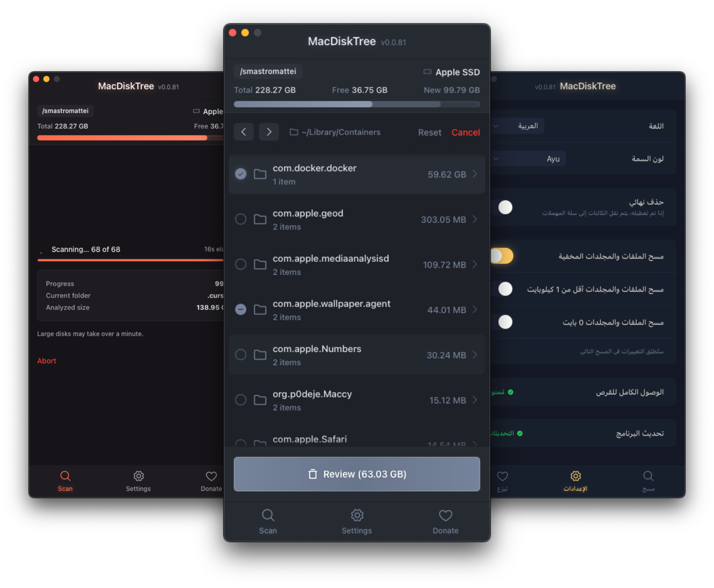

# MacDiskTree

A macOS tool to easily identify and get rid of big, unused files and folders in seconds.

## Why?

Over time, your home folder quietly fills up with forgotten caches, old installers, duplicate images, leftover app data, and all sorts of files you didn't even know were there. macOS doesn't make it easy to figure out where all that space went.

MacDiskTree scans your entire user folder and presents everything as a navigable, size-sorted tree. You can drill into any directory, immediately spot what's taking up the most space, and clean it up — all from a single window.

## Features

- **Hyper-fast scanning** — Directory scanning distributes I/O across all available CPU cores for maximum throughput
- **Smooth UI** — Fine-tuned for performance, clean design, and fluid navigation
- **Smart selection** — Three-state checkboxes with full parent-child logic and a clear preview of how much space you'll reclaim before deleting
- **Safe by design** — Move to Trash by default, critical root macOS (Desktop, Documents, Library, etc.) are protected from deletion with path canonicalization to prevent bypass. Sensitive credential folders (`.ssh`, `.aws`, etc.) are completely ignored
- **10 languages** — English, Italian, Spanish, French, Portuguese, German, Russian, Chinese, Japanese, and Arabic (with RTL support)
- **Accessible** — Fully accessible and keyboard navigable
- **Themes** — Multiple color themes to choose from, with more on the way

> [!WARNING]
> This app can delete files and folders. Use it carefully and review your selections before confirming deletion.

## Preview



## Installation

### Manual

1. Download the latest `.dmg` from [Releases](https://github.com/smastromattei/mac-disk-tree/releases)
2. Drag the app to your Applications folder
3. Before opening, run this command in Terminal to bypass macOS Gatekeeper:

```bash
xattr -cr /Applications/MacDiskTree.app
```

> [!NOTE]
> The only official distribution channel is the [GitHub Releases](https://github.com/smastromattei/mac-disk-tree/releases) page.

## Building from source

**Prerequisites:**

- [Xcode Command Line Tools](https://developer.apple.com/xcode/resources/) — `xcode-select --install`
- [Rust](https://www.rust-lang.org/tools/install) — `curl --proto '=https' --tlsv1.2 -sSf https://sh.rustup.rs | sh`
- [Node.js](https://nodejs.org) >= 22
- [pnpm](https://pnpm.io) >= 10

```bash
# Clone the repository
git clone https://github.com/smastrom/mac-disk-tree.git
cd mac-disk-tree

# Install dependencies
pnpm install

# Add the universal macOS target
rustup target add aarch64-apple-darwin x86_64-apple-darwin

# Build the universal macOS binary
pnpm tauri:build
```

## License

[MIT](./LICENSE) — Simone Mastromattei
