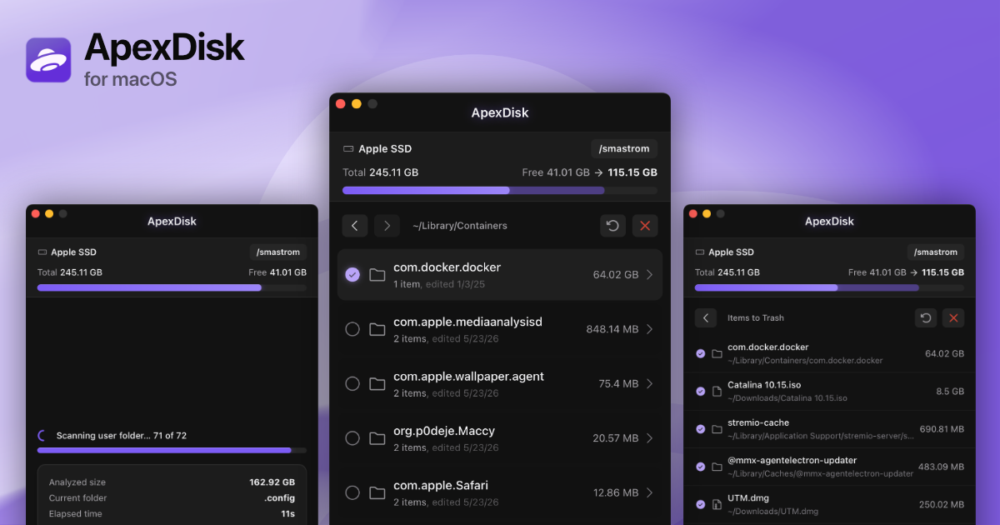

# ApexDisk for Mac

macOS tool to easily identify and get rid of big, unused files and folders in seconds.



## Why ApexDisk?

Your home folder quietly fills with junk that automatic cleaners may not spot or aren't meant to handle: caches and downloads from long‑forgotten apps and games, caches from niche or personal apps no cleaner knows to look for, abandoned developer files like install images, SDKs, and endless other garbage you never knew was eating your disk.

ApexDisk scans your user folder and lays it out as a size-sorted tree, so the heaviest items surface first. Drill into any directory to see exactly what's hiding inside, select what you don't need, review, and send it all to the trash all from a single window.

Visit the [ApexDisk website](https://apexdisk.app) for more information.

## Features

- **Hyper-fast scanning:** Multi-core Rust engine builds the disk tree in seconds
- **Safe by default:** Files move to Trash, system folders stay protected, sensitive directories skipped automatically
- **Built to navigate:** Size-sorted tree with last-modified dates puts the heaviest folders first
- **Optional Full Disk Access:** Works without it by default, prompts only when needed
- **10 languages, 8 color themes:** Including Chinese, Japanese, and Arabic

## Installation

Download the latest `.dmg` (~5MB) from [Releases](https://github.com/smastrom/apex-disk/releases) and drag the app to your Applications folder.

## Building from source

**Prerequisites:**

- [Xcode Command Line Tools](https://developer.apple.com/xcode/resources/): `xcode-select --install`
- [Rust](https://www.rust-lang.org/tools/install): `curl --proto '=https' --tlsv1.2 -sSf https://sh.rustup.rs | sh`
- [Node.js](https://nodejs.org) >= 22
- [pnpm](https://pnpm.io) >= 10

```bash
# Clone the repository
git clone https://github.com/smastrom/apex-disk.git
cd apex-disk

# Install dependencies
pnpm i

# Add target architectures, use `universal-apple-darwin` for a universal binary
rustup target add aarch64-apple-darwin x86_64-apple-darwin

# Build unsigned binary (requires `xattr -cr /path/to/app.app` after building)
pnpm tauri:build:unsigned

# Build signed binary (requires Apple Developer ID and signing credentials)
pnpm tauri:build
```

## Local Development

```bash
# Clone the repository
git clone https://github.com/smastrom/apex-disk.git
cd apex-disk

# Install dependencies
pnpm i

# Run the development server
pnpm tauri:dev
```

## Support ApexDisk

Enjoying ApexDisk? Support the author with a donation:

- [PayPal](https://www.paypal.com/donate/?hosted_button_id=93WKXA68W9WQJ)
- [Buy Me a Coffee](https://buymeacoffee.com/smastrom)
- [Crypto (NOWPayments)](https://nowpayments.io/donation/smastrom) (BTC, ETH, USDT, etc.)

## License

Copyright (C) 2026 Simone Mastromattei. This project is licensed under the [GNU General Public License v3.0](./LICENSE) (GPL-3.0).
