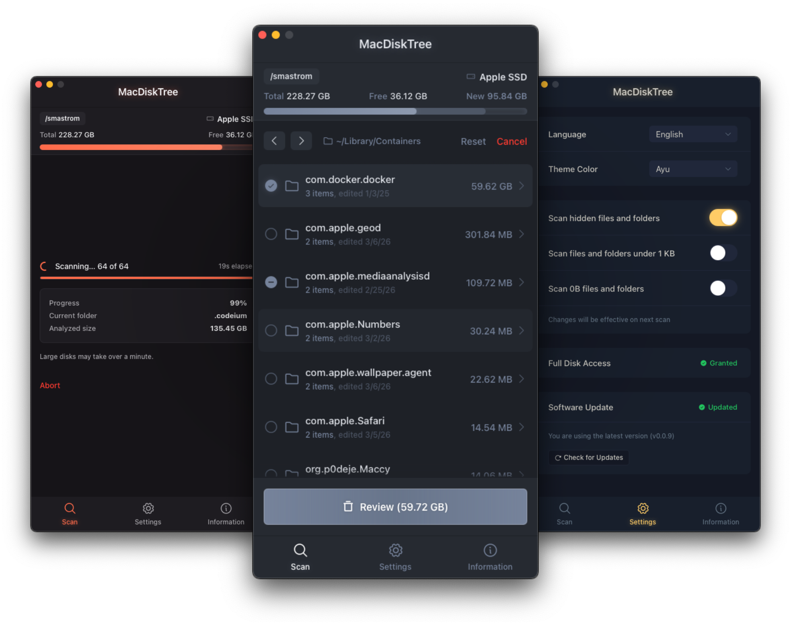

# MacDiskTree

A macOS tool to easily identify and get rid of big, unused files and folders in seconds.

## Why?

Over time, your home folder quietly fills up with forgotten caches, old installers, duplicate images, leftover app data, and all sorts of files you didn't even know were there. macOS doesn't make it easy to figure out where all that space went.

MacDiskTree scans your entire user folder and presents everything as a navigable, size-sorted tree. You can drill into any directory, immediately spot what's taking up the most space, and clean it up — all from a single window.

## Features

- **Hyper-fast scanning** — Directory scanning distributes I/O across all available CPU cores for maximum throughput
- **Smooth UI** — Performance-minded interface with fluid animations, a clean design, and snappy navigation
- **Smart UX** — Easily spot waste with a size-sorted tree and last-modified dates. See exactly how much space you'll save in the header as you select files.
- **Safe by design** — Files are moved to the Trash, never deleted directly. Reserved system folders are protected, and sensitive directories (like .ssh or .aws) are automatically skipped.
- **Optional Full Disk Access** — Works without FDA by default. Granting it allows you to skip repetitive macOS permission prompts.
- **10 languages** — Support for English, Italian, Spanish, French, Portuguese, German, Russian, Chinese, Japanese, and Arabic (with RTL support)
- **Accessible** — Engineered for everyone with complete keyboard navigation and screen reader support
- **Themes** — Multiple color themes to choose from, with more on the way

## Preview



## Installation

1. Download the latest `.dmg` from [Releases](https://github.com/smastrom/mac-disk-tree/releases)
2. Drag the app to your Applications folder
3. Before opening, run this command in Terminal to bypass macOS Gatekeeper:

```bash
xattr -cr /Applications/MacDiskTree.app
```

> [!NOTE]
> **Only install from [GitHub Releases](https://github.com/smastrom/mac-disk-tree/releases).** Downloads from other sources are unverified and may not match the official builds provided here. GitHub is currently the only official distribution channel.

### Security & Notarization

> [!IMPORTANT]
> As of right now, MacDiskTree is not officially signed or notarized by Apple. Because of it, macOS will likely block it or claim it is "damaged" when you first try to open it.
> You can fix it by running in your terminal: `xattr -cr /Applications/MacDiskTree.app`.

#### Why this step?

The command simply tells macOS to "clear" the security flags it attaches to apps downloaded from the internet. It doesn't modify the app's code; it just tells your Mac that you trust the software.

If the project gains enough community interest and matures past the early stages, I'll look into official notarization. In the meantime, the code is right here for you to audit.

## Building from source

**Prerequisites:**

- [Xcode Command Line Tools](https://developer.apple.com/xcode/resources/) — `xcode-select --install`
- [Rust](https://www.rust-lang.org/tools/install) — `curl --proto '=https' --tlsv1.2 -sSf https://sh.rustup.rs | sh`
- [Node.js](https://nodejs.org) >= 22
- [pnpm](https://pnpm.io) >= 10

```bash
# Clone the repository
git clone https://github.com/smastrom/mac-disk-tree.git
cd mac-disk-tree

# Install dependencies
pnpm install

# Add the universal macOS target
rustup target add aarch64-apple-darwin x86_64-apple-darwin

# Build (skips updater artifacts so no signing key is required).
# The app is ad-hoc signed during the build so it runs with the correct bundle ID and entitlements.
pnpm tauri:build
```

## License

[MIT](./LICENSE)
