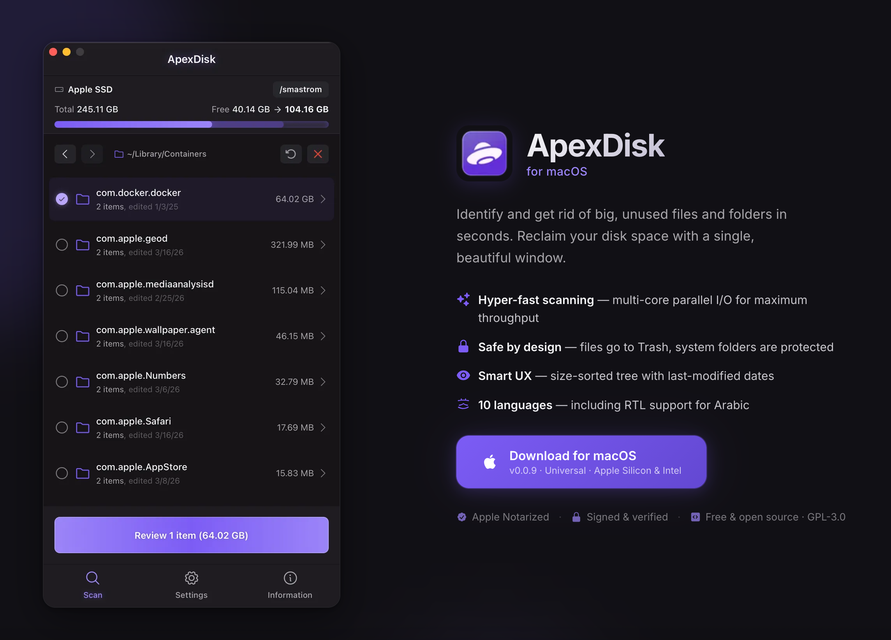

# ApexDisk for Mac

macOS tool to easily identify and get rid of big, unused files and folders in seconds.



## Why?

Over time, your home folder quietly fills up with forgotten caches, old installers, duplicate images, leftover app data, and all sorts of files you didn't even know were there. macOS doesn't make it easy to figure out where all that space went.

ApexDisk scans your entire user folder and presents everything as a navigable, size-sorted tree. You can drill into any directory, immediately spot what's taking up the most space, and clean it up, all from a single window.

## Features

- **Hyper-fast scanning**: Directory scanning distributes I/O across all available CPU cores for maximum throughput
- **Smart UX**: Easily spot waste with a size-sorted tree and last-modified dates. See exactly how much space you'll save as you select files.
- **Safe by design**: Files are moved to the Trash, never deleted directly. Reserved system folders are protected, and sensitive directories are automatically skipped on scan.
- **Optional Full Disk Access**: Works without FDA by default with on demand permission prompts
- **10 languages**: Support for English, Italian, Spanish, French, Portuguese, German, Russian, Chinese, Japanese, and Arabic (with RTL support)

## Installation

Download the latest `.dmg` from [Releases](https://github.com/smastrom/apex-disk/releases) and drag the app to your Applications folder.

## Building from source

**Prerequisites:**

- [Xcode Command Line Tools](https://developer.apple.com/xcode/resources/): `xcode-select --install`
- [Rust](https://www.rust-lang.org/tools/install): `curl --proto '=https' --tlsv1.2 -sSf https://sh.rustup.rs | sh`
- [Node.js](https://nodejs.org) >= 22
- [pnpm](https://pnpm.io) >= 10

```bash
# Clone the repository
git clone https://github.com/smastrom/apex-disk.git
cd apex-disk

# Install dependencies
pnpm i

# Add target architectures, use `universal-apple-darwin` for a universal binary
rustup target add aarch64-apple-darwin x86_64-apple-darwin

# Build unsigned binary (requires `xattr -cr /path/to/app.app` after building)
pnpm tauri:build:unsigned

# Build signed binary (requires Apple Developer ID and signing credentials)
pnpm tauri:build
```

## Local Development

```bash
# Clone the repository
git clone https://github.com/smastrom/apex-disk.git
cd apex-disk

# Install dependencies
pnpm i

# Run the development server
pnpm tauri:dev
```

## Saying thanks

Enjoying ApexDisk? Say thanks by sponsoring the project:

- [PayPal](https://www.paypal.com/donate/?hosted_button_id=93WKXA68W9WQJ)
- [Buy Me a Coffee](https://buymeacoffee.com/smastrom)
- [Crypto (NOWPayments)](https://nowpayments.io/donation/smastrom)

## License

Copyright (C) 2026 Simone Mastromattei. This project is licensed under the [GNU General Public License v3.0](./LICENSE) (GPL-3.0).
