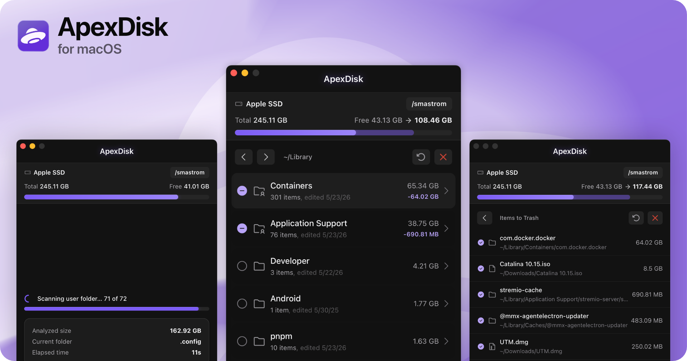

# Releases

Changelog for **stable** builds shipped via the GitHub Release workflow. Newest-first; the Release workflow reads the first `## vX.Y.Z` heading. See [`reference/releases.md`](reference/releases.md) for how to cut a release, and [`reference/updates.md`](reference/updates.md) for the in-app updater.

---

## v1.0.0

### Release Notes

Hello everyone, I am happy to finally announce the first release of ApexDisk, now available to download on [GitHub Releases](https://github.com/smastrom/apex-disk/releases) and the [ApexDisk Website](https://apexdisk.app/releases).

As the headline states, ApexDisk is a macOS tool to easily identify and get rid of big, unused files and folders in seconds.

Over the years, I've found myself using different tools to find and get rid of leftovers that automatic cleaners can't or are not meant to catch, but none of them was really enjoyable, free and most importantly: streamlined to the essentials.

After a few months of development, I finally decided to release the first version of ApexDisk.

Please visit the [ApexDisk Website](https://apexdisk.app) for more information and to get started.

### Features

- **Hyper-fast scanning:** Multi-core Rust engine builds the disk tree in seconds
- **Safe by default:** Files move to Trash, system folders stay protected, sensitive directories skipped automatically
- **Built to navigate:** Size-sorted tree with last-modified dates puts the heaviest folders first
- **Optional Full Disk Access:** Works without it by default, prompts only when needed
- **10 languages, 8 color themes:** Including Chinese, Japanese, and Arabic

### Installation

Download the latest `.dmg` (~5MB) from [Releases](https://github.com/smastrom/apex-disk/releases) or the [ApexDisk Website](https://apexdisk.app/releases) and drag the app to your Applications folder.

### Links

- [ApexDisk Website](https://apexdisk.app)
- [GitHub Repository](https://github.com/smastrom/apex-disk)
- [GitHub Discussions](https://github.com/smastrom/apex-disk/discussions)
- [GitHub Releases](https://github.com/smastrom/apex-disk/releases)
